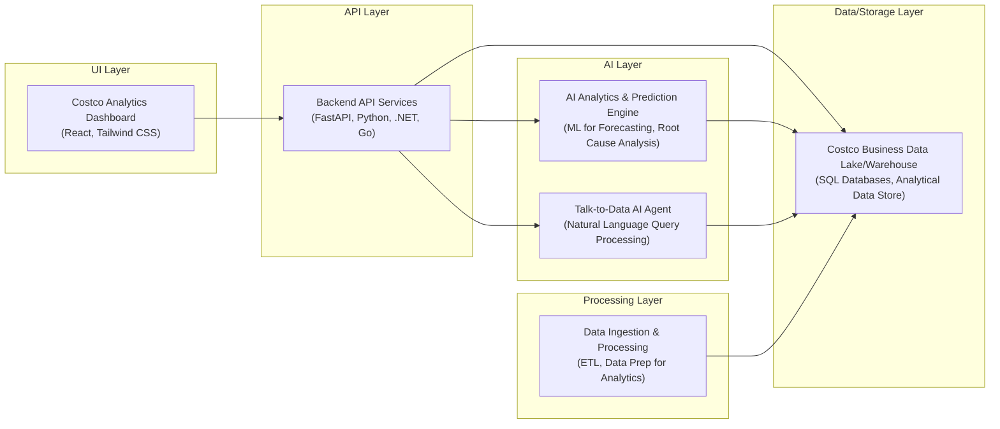

# Costco Analytics

## Overview
*   An AI-powered analytics platform for Costco Business Centers.
*   Provides real-time dashboards and a natural language "Talk-to-Data" interface.
*   Supports descriptive, diagnostic, predictive, and prescriptive analytics types.
*   Aims to empower business users with data insights through conversational AI.
*   Leverages Google Cloud Platform for scalable data processing and AI capabilities.

## Business Problem
*   Costco Business Centers need deeper, actionable insights from their operational data.
*   Traditional reporting can be slow and requires specialized data expertise.
*   Identifying root causes for performance drops or opportunities for growth is challenging.
*   Forecasting future trends and generating data-driven recommendations is often complex.
*   There's a need for an intuitive way for business users to query and understand data.

## Key Capabilities
*   **Descriptive Analytics**: Real-time dashboards displaying key performance indicators.
*   **Diagnostic Analytics**: AI-powered root cause analysis to explain trends.
*   **Predictive Analytics**: Machine learning models for sales and conversion forecasting.
*   **Prescriptive Analytics**: Actionable recommendations for business optimization.
*   **Talk-to-Data Interface**: Natural language processing to query data conversationally.
*   **Dynamic Chart Generation**: Automatically visualizes data based on user queries.
*   **BigQuery ML Integration**: Utilizes in-database machine learning for advanced analytics.
*   **Scalable Architecture**: Built on Google Cloud for robust performance and growth.

## Tech Stack
*   **Cloud**: Google Cloud Platform (GCP)
*   **Backend**: Python, FastAPI
*   **Frontend**: React, Tailwind CSS, Vite
*   **Data**: Google BigQuery, BigQuery ML
*   **AI/ML**: Google Vertex AI (Gemini 2.0 Agent)

## Architecture Flow
1.  User accesses the analytics platform frontend (React application).
2.  User views interactive dashboards or enters a natural language query in the chat interface.
3.  Frontend sends API requests (for dashboards) or user queries (for chat) to the FastAPI backend.
4.  For chat queries, the FastAPI backend routes the request to the Vertex AI Gemini 2.0 Agent.
5.  The Gemini Agent analyzes the natural language query and orchestrates appropriate tools (e.g., SQL Tool, Predict Tool, Chart Tool).
6.  Tools generate and execute SQL queries against BigQuery, invoke BigQuery ML models, or prepare data for visualization.
7.  BigQuery processes the data, executes ML models, and returns results to the tools.
8.  The Gemini Agent synthesizes the tool outputs into a natural language response or structured data.
9.  The FastAPI backend receives the response/data from the Gemini Agent (or directly from BigQuery for dashboards).
10. Backend sends the processed information back to the frontend.
11. Frontend renders dashboards, charts, or the AI-generated chat response to the user.

## Repository Structure
```
costco-analytics/
├── backend/                  # FastAPI application, Vertex AI integration
│   ├── main.py
│   └── requirements.txt
├── frontend/                 # React application with Tailwind CSS
│   ├── src/
│   ├── package.json
│   └── tailwind.config.js
├── data/                     # Sample data and generation scripts
│   ├── pos_sales_sample.csv
│   └── generate_sample_data.py
├── sql/                      # BigQuery schema and ML model definitions
│   └── 01_schema.sql
├── deploy/                   # Cloud deployment configurations
│   ├── cloudbuild.yaml
│   └── Dockerfile
└── README.md
```

## Local Setup

### Prerequisites
*   Google Cloud Project with billing enabled
*   `gcloud` CLI installed and configured
*   Node.js 18+ and npm
*   Python 3.11+

### Step 1: Set Up GCP Resources
```bash
export PROJECT_ID="your-project-id"
export REGION="us-central1"

gcloud services enable bigquery.googleapis.com aiplatform.googleapis.com run.googleapis.com cloudbuild.googleapis.com
bq mk --location=US costco_analytics
```

### Step 2: Load Data into BigQuery
```bash
bq query --use_legacy_sql=false < sql/01_schema.sql

cd data
python generate_sample_data.py

bq load --source_format=NEWLINE_DELIMITED_JSON costco_analytics.leads leads.json
bq load --source_format=NEWLINE_DELIMITED_JSON costco_analytics.members members.json
bq load --source_format=NEWLINE_DELIMITED_JSON costco_analytics.pos_sales pos_sales.json
```

### Step 3: Run Backend Locally
```bash
cd backend
python -m venv venv
source venv/bin/activate
pip install -r requirements.txt

export GCP_PROJECT_ID="your-project-id"
export GCP_LOCATION="us-central1"

uvicorn main:app --reload --port 8080
```

### Step 4: Run Frontend Locally
```bash
cd frontend
npm install
npm run dev
```
Open `http://localhost:3000` in your browser.

## Deployment

### Deploy Backend to Cloud Run
```bash
cd backend
gcloud builds submit --tag gcr.io/$PROJECT_ID/costco-analytics-api
gcloud run deploy costco-analytics-api \
  --image gcr.io/$PROJECT_ID/costco-analytics-api \
  --platform managed \
  --region $REGION \
  --allow-unauthenticated \
  --set-env-vars "GCP_PROJECT_ID=$PROJECT_ID,GCP_LOCATION=$REGION"
```

### Deploy Frontend to Firebase Hosting
```bash
cd frontend
npm run build
firebase init hosting
firebase deploy
```
## Architecture

AI-Powered Analytics Platform for Costco Business Center.



For a standalone preview, see [docs/architecture.html](docs/architecture.html).

### Key Architectural Aspects:
* Leverages AI/ML for advanced analytics, including predictive forecasting, diagnostic root cause analysis, and prescriptive recommendations.
* Features a 'Talk-to-Data' capability, allowing users to interact with business data using natural language queries via an AI agent.
* Provides a comprehensive analytics platform with real-time dashboards and data visualizations through a modern React frontend and FastAPI backend.
* Utilizes a robust data pipeline to ingest, process, and store Costco Business Center data for all analytical and AI consumption.
